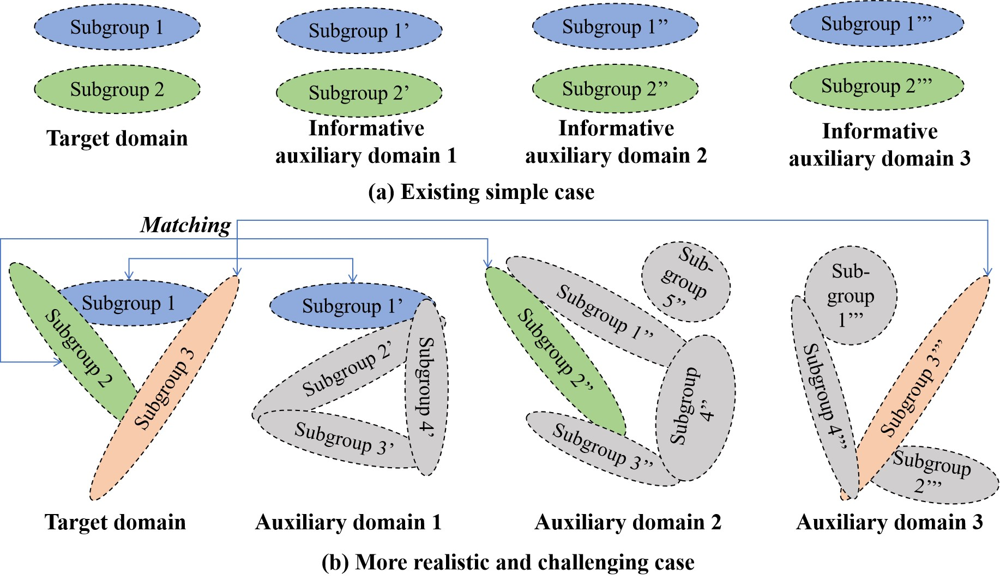

```{r, include = FALSE}
knitr::opts_chunk$set(
  collapse = TRUE,
  comment = "#>"
)
```

# Table of contents

1.  [Description](#Description)
2.  [Transfer learning for undirected graphical models](#TLGGM)
3.  [Transfer learning for tensor Gaussian graphical models](#TLTGGM)
4.  [Structural transfer learning of non-Gaussian DAG](#TLDAG)
5.  [Local transfer learning for Gaussian graphical mixture
    models](#TLGGMM)
6.  [Quick Start](#QuickStart)

# Description {#description}

Transfer learning, aiming to use auxiliary domains to help improve learning of the target domain of interest when multiple heterogeneous datasets are available, has always been a hot topic in statistical machine learning. The recent transfer learning methods with statistical guarantees mainly focus on the overall parameter transfer for supervised models in the ideal case with the informative auxiliary domains with overall similarity. In contrast, transfer learning for unsupervised graph learning is in its infancy and largely follows the idea of overall parameter transfer as for supervised learning. In this package, the transfer learning for several complex graphical models is implemented, including Tensor Gaussian graphical models, non-Gaussian directed acyclic graph (DAG), and Gaussian graphical mixture models (GGMMs). Notably, this package promotes local transfer at node-level and subgroup-level in DAG structural learning and GGMMs, respectively, which are more flexible and robust than the existing overall parameter transfer. As by-products, transfer learning for undirected graphical model (precision matrix) via D-trace loss, transfer learning for mean vector estimation, and single non-Gaussian learning via topological layer method are also included in this package. Moreover, the aggregation of auxiliary information is an important issue in transfer learning, and this package provides multiple user-friendly aggregation methods, including sample weighting, similarity weighting, and most informative selection.


# Transfer learning for undirected graphical models {#TLGGM}

## Data setting

Suppose that besides observations $\{ \boldsymbol{x}_i\}_{i=1}^n$ from
the target domain, observations
$\{ \boldsymbol{x}_i^{(k)}\}_{i=1}^{n_k}$; $k \in [K]$ from some
auxiliary domains are also available. We are interested in estimating
the precision matrix $\boldsymbol{\Theta} = \boldsymbol{\Sigma}^{-1}$ in
the target domain via transfer learning. The informative auxiliary set
$\{ k: \| \widehat{\mathbf{\Delta}}^{(k)} \|_{1, \infty} + \| ( \widehat{\mathbf{\Delta}}^{(k)} )^{\top} \|_{1, \infty} \leqslant h \}$
is non-empty for some sufficiently small $h>0$, where
$\boldsymbol{\Delta}^{(k)} = \boldsymbol{\Theta} \boldsymbol{\Sigma}^{(k)} - \boldsymbol{I}_{p}$,
and $\boldsymbol{\Sigma}^{(k)}$ is the covariance matrix of the $k$-th
auxiliary domain.

## Methodology

This package adopts a multi-step algorithm. Specifically, it start with aggregating all the auxiliary covariance matrices,
\begin{equation}\label{na-weight}
	\widehat{\boldsymbol{\Sigma}}^{\mathcal{A}} = \sum_{k=1}^{K} \alpha_k \widehat{\boldsymbol{\Sigma}}^{(k)},
\end{equation}
where the $\alpha_k$ is the weight of the $k$-th domain, and three aggregation methods are considered.


1. Weighted by sample sizes. $\alpha_k = n_k / \sum_{k=1}^{K} n_k$, which applies to ideal situations where all auxiliary domains are informative. 

2. Weighted by differences. Some data-adaptive weights for auxiliary covariance matrices are designed, in which weights are constructed combining both sample sizes and the estimated differences between the target and auxiliary domains. Particularly, $\alpha_k = \frac{n_k / \widehat{h}_k}{\sum_{k=1}^{K} (n_k / \widehat{h}_k)}$,
where $\widehat{h}_k = \| \widehat{\boldsymbol{\Delta}}^{(k)} \|_{F}^2$ and  $\widehat{\boldsymbol{\Delta}}^{(k)} = \widehat{\boldsymbol{\Theta}}^{(0)} \widehat{\boldsymbol{\Sigma}}^{(k)}  - \boldsymbol{I}_{p}$ is a divergence matrix measuring the difference between the target and auxiliary precision matrices, and $\widehat{ \mathbf{\Theta}}^{(0)}$ is an initial estimate on the target samples $\mathbf{X}$ only.

3. Most informative selection. Select the most parameter-informative auxiliary domain, $\check{k} = \arg \min_{k \in [K]} \ \Big( \|  \widehat{\mathbf{\Delta}}^{(k)} \|_{1, \infty} + \|  ( \widehat{\mathbf{\Delta}}^{(k)} )^{\top} \|_{1, \infty} \Big)$, which is most robust.


Based on the target precision and aggregated auxiliary covariance matrices, denote $\widehat{\boldsymbol{\Delta}}^{\mathcal{A}} = \widehat{\boldsymbol{\Theta}}^{(0)} \widehat{\boldsymbol{\Sigma}}^{\mathcal{A}}  - \boldsymbol{I}_{p}$, and then estimate
\begin{equation}
	\label{eq:Delta}
	\widehat{\mathbf{\Delta}} = \arg \min_{\mathbf{\Delta}} \ \Big( \frac{1}{2} \operatorname{tr} \{ \mathbf{\Delta}^{\top} \mathbf{\Delta} \}-\operatorname{tr} \{ ( \widehat{\mathbf{\Delta}}^{\mathcal{A}}) ^{\top} \mathbf{\Delta} \}+ \lambda_{1} \| \mathbf{\Delta} \|_1 \Big),
\end{equation}
which essentially conducts an adaptive thresholding on $\widehat{\mathbf{\Delta}}^{\mathcal{A}}$ and shrinks some small elements of $\widehat{\mathbf{\Delta}}^{\mathcal{A}}$ to be exactly 0 in $\widehat{\mathbf{\Delta}}$. With $\widehat{\mathbf{\Delta}}$, the estimate of $\mathbf{\Theta}$ can be obtained as
\begin{equation}
	\label{eq:Theta}
	\widehat{ \mathbf{\Theta}} = \arg \min_{\mathbf{\Theta} } \ \Big( \frac{1}{2} \operatorname{tr} \{ \mathbf{\Theta}^{\top} \widehat{\mathbf{\Sigma}}^{\mathcal{A}} \mathbf{\Theta} \} -\operatorname{tr} \{ ( \widehat{\mathbf{\Delta}}^{\top}+ \boldsymbol{I}_{p} ) \mathbf{\Theta} \} + \lambda_{2} \| \mathbf{\Theta} \|_{1, \mathrm{off}} \Big).
\end{equation}
 

Note that the estimate $\widehat{ \mathbf{\Theta}}$ can be asymmetric, it is thus recommended to use $(\widehat{ \mathbf{\Theta}} + \widehat{ \mathbf{\Theta}}^{\top}) / 2$ as the final symmetric estimate. The optimization tasks in the last two steps are convex and can be efficiently solved via coordinate descent, and the tuning parameters therein can be determined via the BIC-type criteria, with details being provided as follows. 


For estimating $\widehat{\boldsymbol{\Delta}}$, the objective function can be rewritten as
\begin{equation}\nonumber
	\begin{aligned}
		\frac{1}{2} \sum_{1 \leqslant i,j \leqslant p} \Delta_{ij}^2 - \sum_{1 \leqslant i,j \leqslant p} \widehat{\Delta}^{\mathcal{A}}_{ij} \Delta_{ij} + \lambda_{1} \sum_{1 \leqslant i,j \leqslant p} |\Delta_{ij} |,
	\end{aligned}
\end{equation}
where $\Delta_{ij}$ and $\widehat{\Delta}^{\mathcal{A}}_{ij}$ are the $(i,j)$ entries of $\boldsymbol{\Delta}$ and $\widehat{\mathbf{\Delta}}^{\mathcal{A}}$, respectively. It can be separated into $p^2$ lasso-type optimizations; that is, for any $i$ and $j$, 
\begin{equation}\label{delta.eq}
	\widehat{\Delta}_{ij} = \arg \min_{\Delta} \left\{  \frac{1}{2} (\Delta - \widehat{\Delta}^{\mathcal{A}}_{ij} )^2 + \lambda_{1} | \Delta | \right\} = \mathcal{T}( \widehat{\Delta}^{\mathcal{A}}_{ij}, \lambda_{1}),
\end{equation}
where $\mathcal{T}(z, \lambda) = \mathrm{sign}(z) \max (0, |z| - \lambda)$.


For estimating $\widehat{\mathbf{\Theta}}$, the objective function can be rewritten as
\begin{equation}\nonumber
	\begin{aligned}
		\sum_{1 \leqslant j \leqslant p} \left\{ \frac{1}{2} \mathbf{\Theta}_{j}^{\top} \widehat{\mathbf{\Sigma}}^{(k)} \mathbf{\Theta}_{j} - \mathbf{\Theta}_{j}^{\top}( \widehat{\boldsymbol{\Delta}}_{j}+ [\boldsymbol{I}_p]_{j} )  + \lambda_{2} \| \mathbf{\Theta}_{j} \|_1 - \lambda_{2} | \mathbf{\Theta}_{jj} | \right\},
	\end{aligned}
\end{equation}
where $\mathbf{\Theta}_{j}$ and $[\boldsymbol{I}_p]_{j}$ are the $j$-th columns of $\mathbf{\Theta}$ and $\boldsymbol{I}_p$, respectively. It can be separated into $p$ optimizations; that is, for any $j$, 
\begin{equation}\label{thetaj}
	\begin{aligned}
		\widehat{\mathbf{\Theta}}_{j} = \arg \min_{\boldsymbol{\theta}} \left\{  \frac{1}{2} \boldsymbol{\theta}^{\top} \widehat{\mathbf{\Sigma}}^{(k)} \boldsymbol{\theta} - \boldsymbol{\theta}^{\top} ( \widehat{\boldsymbol{\Delta}}_{j}+ [\boldsymbol{I}_p]_{j} ) + \lambda_{2} \| \boldsymbol{\theta}_{-j} \|_1  \right\},
	\end{aligned}
\end{equation}
where $\boldsymbol{\theta}_{-j}$ is the sub-vector of $\boldsymbol{\theta}$ with the $j$-th component removed. For this optimization, we adopt the coordinate descent algorithm. Particularly, at iteration $t + 1$, the updating formula of $\theta_i$, $i$-th component of $\boldsymbol{\theta}$, with other components $\{ \theta_{i^{\prime}}^{(t+1)}, i^{\prime} < i; \  \theta_{i^{\prime}}^{(t)}, i^{\prime} > i \}$ fixed, are
\begin{align}
	\theta^{(t+1)}_i = [\widehat{\mathbf{\Sigma}}^{(k)}_{ii}]^{-1} \mathcal{T}(\iota^{(t)}, \lambda_{2} I(i \ne j)), \text{ for } i = 1, \cdots, p, \nonumber
\end{align}
where $\iota^{(t)} = [\widehat{\boldsymbol{\Delta}} + \boldsymbol{I}_{p}]_{ij} - \sum_{i^{\prime} < i} \theta_{i^{\prime}}^{(t+1)} \widehat{\mathbf{\Sigma}}^{(k)}_{ii^{\prime}} - \sum_{i^{\prime} > i} \theta_{i^{\prime}}^{(t)} \widehat{\mathbf{\Sigma}}^{(k)}_{ii^{\prime}}$.

As computational remarks, the explicit solution derived in each step makes the algorithm very efficient. The initial values of $\boldsymbol{\theta}$ are set as $\widehat{\mathbf{\Theta}}_{j}^{(0)}$. Note that these developments are specifically for the Lasso penalty, and optimization with other penalties may require minor modifications. 
Convergence properties of the algorithm can be guaranteed, thanks to the convexity of the objective function. As for the tuning parameter selection, we set $\lambda_{1} = 2 \| \widehat{\mathbf{\Theta}}^{(0)} \|_{1, \infty} \sqrt{\frac{ \log p}{n}}$. For $\lambda_{2}$, it is suggested to be determined via minimizing a BIC-type criterion, 
$\frac{1}{2} \operatorname{tr} \{ \widehat{\mathbf{\Theta}}^{\top} \widehat{\mathbf{\Sigma}}^{(k)} \widehat{\mathbf{\Theta}} \} -\operatorname{tr} \{ ( \widehat{\boldsymbol{\Delta}}^{\top}+ \boldsymbol{I}_{p} ) \widehat{\mathbf{\Theta}} \} + \frac{ \log N }{N} \| \widehat{\mathbf{\Theta}} \|_{0}$.


# Transfer learning for tensor Gaussian graphical models {#TLTGGM}

## Data setting

Suppose that besides observations
$\{ \boldsymbol{\mathcal{X}}_i\}_{i=1}^n$ from the target domain,
observations $\{ \boldsymbol{\mathcal{X}}_i^{(k)}\}_{i=1}^{n_k}$;
$k \in [K]$ from some auxiliary domains are also available. For example,
in the ADHD brain functional network dataset,
$\{ \boldsymbol{\mathcal{X}}_i\}_{i=1}^n$ are the dynamic activation
levels of many brain regions of interests collected from some fMRI scans
at one neuroscience institute, and
$\{ \boldsymbol{\mathcal{X}}_i^{(k)}\}_{i=1}^{n_k}$ are collected from
$K=6$ other neuroscience institutes for better data analysis in the
target institute. That is, \$ \boldsymbol{\mathcal{X}}\_i\$'s are
independently generated from
$\mathrm{TN}(\boldsymbol{0}; \boldsymbol{\Sigma}_1, \cdots, \boldsymbol{\Sigma}_M)$
and $\boldsymbol{\mathcal{X}}_i^{(k)}$'s are independently generated
from \$ \mathrm{TN}(\boldsymbol{0}; \boldsymbol{\Sigma}\_1\^{(k)},
\cdots, \boldsymbol{\Sigma}\_M\^{(k)})\$ with
$\Sigma_m \in \mathbb{R}^{p_m \times p_m}$ and
$\boldsymbol{\Sigma}_m^{(k)} \in \mathbb{R}^{p_m \times p_m}$.
Particularly, we are interested in estimating the precision matrix
$\boldsymbol{\Omega}_m = (\boldsymbol{\Sigma}_m)^{-1}$ in the target
domain for $m\in [M]$ via transfer learning on the tensor GGMs.

## Methodology

Define the divergence matrix as
$\boldsymbol{\Delta}_{m}^{(k)} = \boldsymbol{\Omega}_m \boldsymbol{\Sigma}_m^{(k)} - \boldsymbol{I}_{p_m}$,
where $\boldsymbol{I}_{p_m}$ is the $p_m$-dimensional identity matrix.
Clearly, it gets closer to $\boldsymbol{0}$ when
$\boldsymbol{\Sigma}_m^{(k)}$ gets closer to $\boldsymbol{\Sigma}_m$,
and thus it provides a natural measure of the similarity between
$\boldsymbol{\Sigma}_m^{(k)}$ and $\boldsymbol{\Sigma}_m$. To leverage
information of all auxiliary domains, we consider the weighted average
of the covariance and divergence matrices as follows,
\begin{equation}\nonumber
        \begin{aligned}
            & \boldsymbol{\Sigma}_m^{\mathcal{A}} = \sum_{k=1}^{K} \alpha_k \boldsymbol{\Sigma}_m^{(k)} \text{ and }
            \boldsymbol{\Delta}_{m} = \sum_{k=1}^{K} \alpha_k \boldsymbol{\Delta}_m^{(k)}, \text{ with } \sum_{k=1}^{K} \alpha_k = 1,
        \end{aligned}
    \end{equation} where the choice of weights $\{\alpha_k\}_{k=1}^{K}$
shall depend on the contribution of each auxiliary domain and will be
discussed in details later. Also, it holds true that
$\boldsymbol{\Omega}_m \boldsymbol{\Sigma}_m^{\mathcal{A}} - \boldsymbol{\Delta}_{m} - \boldsymbol{I}_{p_m} = \boldsymbol{0}$.

For each mode, a multi-step method can be proposed to realize the
transfer learning of tensor graphical models.

Step 1. Initialization. Estimate
$\{ \widehat{\boldsymbol{\Omega}}^{(0)}_m \}_{m=1}^{M}$ based on target
samples \${ \boldsymbol{\mathcal{X}}*i }*{i=1}\^{n} \$, and
$\{ \widehat{\boldsymbol{\Omega}}_{m}^{(k)} \}_{m=1}^{M}$ based on
auxiliary samples $\{ \boldsymbol{\mathcal{X}}_i^{(k)}\}_{i=1}^{n_k}$,
for $k \in [K]$, using the separable estimation approach \`\`Tlasso".
Then, define \begin{equation}\nonumber
        \begin{aligned}
            & \widehat{\boldsymbol{\Sigma}}_m^{\mathcal{A}} = \sum_{k=1}^{K} \alpha_k \widehat{\boldsymbol{\Sigma}}_m^{(k)}, \ \ \text{ where } \widehat{\boldsymbol{\Sigma}}_m^{(k)} =  \frac{p_m}{n_k p} \sum_{i=1}^{n_k}\widehat{\boldsymbol{V}}_{i,m}^{(k)} \widehat{\boldsymbol{V}}_{i,m}^{(k) \top}, \\
            & \widehat{\boldsymbol{V}}_{i,m}^{(k)} = [ \boldsymbol{\mathcal{X}}_{i}^{(k)}]_{(m)} \left[  ( \widehat{\boldsymbol{\Omega}}_M^{(k)} )^{1/2} \otimes \cdots \otimes ( \widehat{\boldsymbol{\Omega}}_{m+1}^{(k)} )^{1/2} \otimes (\widehat{\boldsymbol{\Omega}}_{m-1}^{(k)})^{1/2} \otimes \cdots \otimes (\widehat{\boldsymbol{\Omega}}_{1}^{(k)})^{1/2} \right].
        \end{aligned}
    \end{equation}

Step 2. For each $m \in [M]$, perform the following two estimation steps
separately.

(a). Estimate the divergence matrix of mode-$m$, \begin{equation}
            \widehat{\boldsymbol{\Delta}}_{m} = \arg \min \mathcal{Q}_{1} (\boldsymbol{\Delta}_m ),
\end{equation} where
$\mathcal{Q}_{1} (\boldsymbol{\Delta}_{m} ) = \frac{1}{2} \operatorname{tr} \{ \boldsymbol{\Delta}_{m}^{\top} \boldsymbol{\Delta}_{m} \}-\operatorname{tr} \left\{ ( \widehat{\boldsymbol{\Omega}}_m^{(0)} \widehat{\boldsymbol{\Sigma}}_m^{\mathcal{A}} - \boldsymbol{I}_{p_m} ) ^{\top} \boldsymbol{\Delta}_{m} \right\}+ \lambda_{1m} \| \boldsymbol{\Delta}_{m} \|_1$.

    (b). Estimate the precision matrix of mode-$m$,

\begin{equation}
            \widehat{\boldsymbol{\Omega}}_{m} = \arg \min \mathcal{Q}_{2} ( \boldsymbol{\Omega}_{m} ),
\end{equation} where
$\mathcal{Q}_{2} ( \boldsymbol{\Omega}_{m}) = \frac{1}{2} \operatorname{tr} \{ \boldsymbol{\Omega}_{m}^{\top} \widehat{\boldsymbol{\Sigma}}_m^{\mathcal{A}} \boldsymbol{\Omega}_{m} \} -\operatorname{tr} \{ ( \widehat{\boldsymbol{\Delta}}_{m}^{\top}+ \boldsymbol{I}_{p_m} ) \boldsymbol{\Omega}_{m} \} + \lambda_{2m} \| \boldsymbol{\Omega}_{m} \|_{1, \mathrm{off}}$.

Moreover, the similarity between the target and auxiliary domains may be
weak in some scenarios, so that the learning performance in the target
domain may be deteriorated due to information transfer, which is
so-called \`\`negative transfer". One practical solution is to further
perform a model selection step following, which guarantees that transfer
learning is no less effective than using only the target domain. To this
end, the data from the target domain can be randomly split into two
folds $\mathcal{N}$ and $\mathcal{N}^C$, satisfying
$\mathcal{N} \cup \mathcal{N}^C = \{ 1, \cdots, n \}$ and
$\text{card}(\mathcal{N}) = cn$, for some constant $0 < c <1$. The value
of $c$ is not sensitive, and we set $c=0.6$ in all numerical
experiments. The subjects in $\mathcal{N}$ are used to construct the
initialization of the separable transfer estimation in Step 1. The
selection step is performed based on subjects in $\mathcal{N}^C$.
Specifically, based on
$\{ \widetilde{\boldsymbol{\Omega}}_{m}^{(0)} \}_{m=1}^{M}$ estimated
using subjects in $\mathcal{N}^C$, for $j = 1, \cdots, p_m$, define
$\widetilde{\boldsymbol{\Sigma}}_m = \frac{p_m}{ (1-c)n p} \sum_{i \in \mathcal{N}^C} \widetilde{\boldsymbol{V}}_{i,m} \widetilde{\boldsymbol{V}}_{i,m}^{\top}$,
$\widetilde{\boldsymbol{V}}_{i,m} = [\boldsymbol{\mathcal{X}}_{i}]_{(m) } \left[ ( \widetilde{\boldsymbol{\Omega}}_M^{(0)} )^{1/2} \otimes \cdots \otimes ( \widetilde{\boldsymbol{\Omega}}_{m+1}^{(0)} )^{1/2} \otimes (\widetilde{\boldsymbol{\Omega}}_{m-1}^{(0)} )^{1/2} \otimes \cdots \otimes (\widetilde{\boldsymbol{\Omega}}_{1}^{(0)} )^{1/2} \right]$,
and \begin{equation}\nonumber
        \begin{aligned}
            & \widehat{w}_{m,j} = \underset{ w \in \{ (0,1)^{\top}, (1,0)^{\top} \} }{\arg\min} \|  \widetilde{\boldsymbol{\Sigma}}_m ( \widehat{\boldsymbol{\Omega}}^{(0)}_{m(j)}, \widehat{\boldsymbol{\Omega}}_{m(j)} ) w -  \boldsymbol{I}_{p_m(j)} \|_2^2,
        \end{aligned}
    \end{equation} where $\widehat{\boldsymbol{\Omega}}^{(0)}_{m(j)}$,
$\widehat{\boldsymbol{\Omega}}_{m(j)}$, and $\boldsymbol{I}_{p_m(j)}$
are the $j$-th columns of $\widehat{\boldsymbol{\Omega}}^{(0)}_{m}$,
$\widehat{\boldsymbol{\Omega}}_{m}$, and $\boldsymbol{I}_{p_m}$,
respectively. Then the final estimate becomes
%$\widehat{\boldsymbol{\Omega}}_{m(j)} = (\widehat{\boldsymbol{\Omega}}^{(0)}_{m(j)}, \widehat{\boldsymbol{\Omega}}_{m(j)}) \widehat{w}_{m,j}$.
\begin{equation}\label{omega_obj}
        \widehat{\boldsymbol{\Omega}}_{m(j)}^{(f)} = (\widehat{\boldsymbol{\Omega}}^{(0)}_{m(j)}, \widehat{\boldsymbol{\Omega}}_{m(j)}) \widehat{w}_{m(j)}.
    \end{equation} The selection step realizes a model selection between
the $\widehat{\boldsymbol{\Omega}}^{(0)}_{m(j)}$ and
$\widehat{\boldsymbol{\Omega}}_{m(j)}$, which yields satisfactory
theoretical and numerical performance. Note that
$\widehat{\boldsymbol{\Omega}}_{m}^{(f)}$ is not symmetric in general,
and
$(\widehat{\boldsymbol{\Omega}}_{m}^{(f)} + [\widehat{\boldsymbol{\Omega}}_{m}^{(f)}]^{\top}) / 2$
can be used as a symmetric estimate. Furthermore, it can be
theoretically guaranteed that the final estimate is positive definite.

For the weights on auxiliary domains, a natural choice of is to set
\begin{equation}
        \widehat{\boldsymbol{\Sigma}}_m^{\mathcal{A}} = \sum_{k=1}^{K} \alpha_k \widehat{\boldsymbol{\Sigma}}_m^{(k)}, \ \mbox{with} \ \alpha_k = n_k / N \ \mbox{and} \  N = \sum_{k=1}^{K} n_k,
    \end{equation} following from the fact that the auxiliary domain
with larger sample size shall be more important. Yet, it does not take
into account the similarities between the target and auxiliary domains.
If there are some large non-informative auxiliary domains, although the
final model selection step can guarantee that transfer learning is no
less effective than using the target domain only, it may also offset the
potential improvement benefiting from the informative auxiliary domains
with positive impact.

To address this challenge, we further design some data-adaptive weights
for auxiliary covariance matrices, in which weights are constructed
combining both sample sizes and the estimated differences between the
target and auxiliary domains. Particularly, we set \begin{equation}
\widehat{\boldsymbol{\Sigma}}_m^{\mathcal{A}} = \sum_{k=1}^{K} \alpha_k \widehat{\boldsymbol{\Sigma}}_m^{(k)}, \text{ with } \alpha_k = \frac{n_k / \widehat{h}_k}{\sum_{k=1}^{K} (n_k / \widehat{h}_k)},
\end{equation} where
$\widehat{h}_k = \max_{m \in [M]} \| \widehat{\boldsymbol{\Delta}}_{m}^{(k)} \|_{F}^2$
and
$\widehat{\boldsymbol{\Delta}}_{m}^{(k)} = \widehat{\boldsymbol{\Omega}}_m^{(0)} \widehat{\boldsymbol{\Sigma}}_m^{(k)} - \boldsymbol{I}_{p_m}$.
Clearly, for auxiliary domains with similar sample size, the weight for the one with smaller difference from the target domain is larger. Here we note that the type of norm for measuring similarity is not critical, and the specified $L_1$-norm is only for keeping with the form on theoretical analysis and may be replaced by other norms with slight modification. It is also interesting to note that even with such data-adaptive weights, the model selection step is still necessary to safeguard the extreme case where all the auxiliary domains are non-informative.


# Structural transfer learning of non-Gaussian DAG {#TLDAG}

## Data and model setting

### DAG and topological layers
It is helpful to briefly introduce the single DAG learning. Consider a DAG ${\cal G}=\{ {\cal N},{\cal E}\}$, encoding the joint distribution $P(\boldsymbol{x})$ of $\boldsymbol{x}=(x_1,...,x_p)^T \in \mathbb{R}^p$, where  ${\cal N}=\{1,\ldots,p\}$ consists of a set of nodes associated with each coordinate of $\boldsymbol{x}$, and  $ {\cal E}\subset {\cal N}\times{\cal N}$ consists of all the directed edges among the nodes. For each node $j$, its parents, children, and descendants are denoted as $\mbox{pa}_j$, $\text{ch}_j$, and $\text{de}_j$, respectively. Each node $x_j$ is also centered with mean zero. 


Suppose that the joint distribution of $\boldsymbol{x}$ can also be embedded into a linear structural equation model (SEM),
\begin{align}\label{eqn:1}
	x_j=\sum_{l \in \mbox{pa}_j} {\beta_{jl}} x_l + \epsilon_j; \ j=1,...,p,
\end{align}
where ${\beta_{jl}}\neq 0$ for any $l \in \mbox{pa}_j$,  $\epsilon_j$ denotes a continuous non-Gaussian noise with variance $\sigma_j^2$, and $\epsilon_l \perp \!\!\! \perp \epsilon_j$ for any $l \neq j$. This independent noise condition also implies that $\epsilon_j \perp \!\!\! \perp x_l$ for any $l \notin \mbox{de}_j\cup \{j\}$.

Without loss of generality, assume ${\cal G}$ has a total of $T$ topological layers. All the leaf nodes and isolated nodes in ${\cal G}$ belong to the lowest layer ${\cal A}_{0}$. For $t = 1, \ldots, T-1$, ${\cal A}_t$ denotes all the nodes contained in the $t$-th layer, whose longest distance to a leaf node is exactly $t$.  It is then clear that  $\cup_{t=0}^{T-1}{\cal A}_{t}={\cal N}$. Further, for each node $j \in {\cal A}_t$, it follows from the layer construction that $\mbox{pa}_j \subset {\cal S}_{t+1}=\cup_{d=t+1}^{T-1}{\cal A}_d$, and ${\cal S}_0={\cal N}$. Therefore, acyclicity is automatically guaranteed. Denote $\mathbf{\Theta}^{{\cal S}_t}$ and $\mathbf{\Sigma}_{{\cal S}_t}$ as the precision and covariance matrices of $\boldsymbol{x}_{{\cal S}_t}$, respectively. Note that the submatrix of the precision matrix $\mathbf{\Theta}_{{\cal S}_t} \ne \mathbf{\Theta}^{{\cal S}_t}$ and $\mathbf{\Theta}^{{\cal S}_{0}}= \mathbf{\Theta}$. The topological layers can help reconstruct the DAG structure. Particularly, for any $j \in {\cal S}_t$, regressing $x_j$ on $\boldsymbol{x}_{{\cal S}_t \setminus \{j\}}$ yields the expected residual $e_{j, {\cal S}_t}=x_j + \boldsymbol{x}_{{\cal S}_t \setminus \{j\}}^{\top} [\mathbf{\Theta}^{{\cal S}_t}]_{-jj}/[\mathbf{\Theta}^{{\cal S}_t}]_{jj}$. It has been shown that 
\begin{align}\label{detest}
	j \in {\cal A}_{t} \text{ if and only if } e_{j, {\cal S}_t} \perp \!\!\! \perp x_l \text{ for any } l\in { {\cal S}_t\backslash \{j\} }.
\end{align}
This result leads to a simple bottom-up learning algorithm to re-construct ${\cal A}_{t}$ for $t = 0,1, \ldots, T-1$ by using the independence test. More importantly, this layer reconstruction algorithm also motivates us to design new concepts and methods for transfer learning of DAG accordingly.


### DAG similarity measures

Denote the target DAG as ${\cal G}_0=\{ {\cal N},{\cal E}_0\}$, which encodes the joint distribution $P_0(\boldsymbol{x})$ of $\boldsymbol{x}=(x_1,...,x_p)^T$ with the precision matrix $\boldsymbol{\Theta}$. Suppose that there also exist $K$ auxiliary DAGs ${\cal G}_k=\{ {\cal N},{\cal E}_k\}$ with $k \in [K]$, encoding the joint distribution $P_k(\boldsymbol{x}^{(k)})$ of $\boldsymbol{x}^{(k)}=(x_1^{(k)},...,x_p^{(k)})^T$ with the precision matrix $\boldsymbol{\Theta}^{(k)}$ and the covariance matrix $\boldsymbol{\Sigma}^{(k)}$. The auxiliary domain $k$ can also be embedded into a linear SEM with different parameters including the continuous non-Gaussian noise $\epsilon^{(k)}_j$ and its variance $[\sigma_j^{(k)}]^2$. It is of great interest to improve the learning accuracy of ${\cal G}_0$ in the target domain by leveraging information from ${\cal G}_k$ in the auxiliary domains.

The effectiveness of such a transfer learning task is heavily based on measuring the similarity between ${\cal G}_0$ and ${\cal G}_k$. In particular, we propose two similarity measures for DAG, corresponding to the strength or presence of causal effects between nodes in different domains as measured in the parameters or graph structures. Denote the divergence matrix  as $\boldsymbol{\Delta}^{(k)}_{{\cal S}_t} = \boldsymbol{\Theta}^{{\cal S}_t} \boldsymbol{\Sigma}^{(k)}_{{\cal S}_t} - \boldsymbol{I}_{|{\cal S}_t|}$, where $\boldsymbol{I}_{|{\cal S}_t|}$ is the $|{\cal S}_t|$-dimensional identity matrix. It measures the similarity between the precision matrices regarding the $t$-th layer in the target and the $k$-th auxiliary domains. By using $\boldsymbol{\Delta}^{(k)}_{{\cal S}_t}$, Definition 1 defines a parametric similarity between ${\cal G}_0$ and ${\cal G}_k$.

Definition 1. (Parametric Similarity) ${\cal G}_k$ is layer-$t$ parameter-informative, if $\|  \boldsymbol{\Delta}^{(k)}_{{\cal S}_t} \|_{1, \infty} + \|  ( \boldsymbol{\Delta}^{(k)}_{{\cal S}_t} )^{\top} \|_{1, \infty} \leqslant h_t$ for some small $h_t>0$.

It is clear that a small value of $h_t$ indicates the precision matrices corresponding to ${\cal S}_t$ in the target and auxiliary domains are close, and thus the information from the auxiliary domain can help improve the estimation accuracy of $\boldsymbol{\Theta}$ in the target domain. Definition 1 is reminiscent of the overall similarity of parameters. 


Definition 2 is among the first attempts to provide some well-defined and comprehensive structural similarities between DAGs, which take advantage of the topological layers and shall greatly facilitate transfer learning for DAGs in various scenarios.

Definition 2. (Structural Similarity) \\
(a) ${\cal G}_k$ is {\rm global structure-informative}, if it has the same number of layers as ${\cal G}_0$, and ${\cal A}_t = {\cal A}_t^{(k)}$ for any $t = 0, 1, \cdots, T-1$, where ${\cal A}_t$ and ${\cal A}_t^{(k)}$ are the nodes contained in the $t$-th layers of ${\cal G}_0$ and ${\cal G}_k$, respectively. \\
(b) ${\cal G}_k$ is {\rm layer-$t$ structure-informative}, if for some $t \in \{ 0, 1, \cdots, T-1 \}$, there exists $t^{\prime} \geqslant 0$, such that ${\cal A}_t = {\cal A}_{t^{\prime}}^{(k)}$ and ${\cal S}_t = {\cal S}_{t^{\prime}}^{(k)}$. \\
(c) ${\cal G}_k$ is {\rm node-$j$ structure-informative}, if (i) $\text{de}_j^{(k)} \cap {\cal S}_{t_j} = \emptyset$ and (ii) $\text{de}_j^{(k)} \cap {\cal A}_{t_j - 1} \ne \emptyset$ with $t_j \geqslant 1$, where $t_j$ denotes the layer to which node-$j$ belongs in ${\cal G}_0$, and $\text{de}_j^{(k)}$ denotes node $j$'s descendants in ${\cal G}_k$.


From Definition 2a, a global structure-informative DAG needs to have exactly the same topological layers as the target DAG. It is important to remark that the global structural similarity concerns only the membership of nodes in each topological layer, and does not impose any requirements on edges between nodes in different layers. The layer-level structural similarity in Definition 2b focuses on the relative positions of one particular topological layer in ${\cal G}_0$ and ${\cal G}_k$. This similarity ensures that information from ${\cal G}_k$ can be efficiently transferred when constructing the topological layer of interest in ${\cal G}_0$. The node-level structural similarity in Definition 2c is a very weak requirement, focusing on local and microcosmic structures of DAGs. A node-$j$ structure-informative DAG only shares a similar relative position of node $j$ as ${\cal G}_0$, where the relative position can be depicted in two cases. Case (i) requires no overlap between node $j$'s descendants in ${\cal G}_k$ and ${\cal S}_{t_j}$ in ${\cal G}_0$, and thus information from ${\cal G}_k$ can prevent assigning node $j$ to a topological layer higher than $t_j$ in ${\cal G}_0$. Case (ii) requires node $j$'s descendants in ${\cal G}_k$ overlap with ${\cal A}_{t_j - 1}$ in ${\cal G}_0$, which can prevent assigning node $j$ to a topological layer lower than $t_j$ in ${\cal G}_0$. It can be verified that these three levels of structural similarities are progressive; that is, a global structure-informative DAG must be layer-$t$ structure-informative for all layers, and a layer-$t$ structure-informative DAG must be node-$j$ structure-informative for all nodes in ${\cal A}_t$. 
For illustration, the following Figure gives some toy examples of these three structural similarities, where only two auxiliary DAGs are informative while others can be of arbitrary structure and thus non-informative.

{width=80%}


It can be observed in Figure (a) that both ${\cal G}_1$ and ${\cal G}_2$ are global structure-informative, which have the same topological layers as ${\cal G}_0$ but their directed edge sets are all different. In Figure (b), ${\cal G}_1$ is layer-$0$ and layer-$1$ structure-informative, and ${\cal G}_2$ is layer-2 and layer-3 structure-informative. They share the same nodes in the respective layers as ${\cal G}_0$, but the composition of other layers is largely different. In Figure (c), ${\cal G}_1$ is node-2, node-4, and node-5 structure-informative, and ${\cal G}_2$ are node-1, node-3, and node-6 structure-informative. Take node-2 as an example, when constructing layer ${\cal A}_1$ of ${\cal G}_0$, ${\cal G}_1$ provides useful information to prevent mis-assigning node 2 to ${\cal A}_1$, since node 4 is a child of node 2 in ${\cal G}_1$ and belongs to ${\cal A}_1$ of ${\cal G}_0$. On the other hand, when constructing ${\cal A}_2$ of ${\cal G}_0$ after ${\cal A}_0$ and ${\cal A}_1$ are determined, ${\cal G}_1$ provides information to assign node 2 to ${\cal A}_2$, thanks to the fact that  node 2's descendants in ${\cal G}_1$ do not appear in ${\cal S}_2$ of ${\cal G}_0$. Similar observations can also be made for other nodes.


## Methodology

Suppose in addition to $\boldsymbol{x} =\ ( {\boldsymbol{x}}_{1}, \ldots, {\boldsymbol{x}}_{p} ) \in \mathbb{R}^{n\times p}$ with ${\boldsymbol{x}}_j=(x_{1j},...,x_{nj})^{\top}$ from the target domain with ${\cal G}_0$, we also observe $\{\boldsymbol{x}^{(k)} \}_{k=1}^K$ from $K$ auxiliary domains with $\boldsymbol{x}^{(k)} \in \mathbb{R}^{n_k \times p}$, where $n$ and $n_k$ are sample sizes of the target and the $k$-th auxiliary domains, respectively, and $n \lesssim n_k$ for any $k \in [K]$. The primary goal is to leverage information in $\{\boldsymbol{x}^{(k)} \}_{k=1}^K$ to help construct ${\cal G}_0$. 

### Generic framework
The proposed generic transfer DAG learning framework is summarized in the following algorithm, where ${\cal A}_{t}$'s are first constructed in a bottom-up fashion from $t=0$ to $t= T-1$ by leveraging the detected informative auxiliary DAGs with various structural similarities, and then directed edges are determined between nodes in different layers based on the estimated target precision matrix.\\
\textbf{Structural tranfer DAG learning algorithm.} \\
\textbf{Input: } $\boldsymbol{x}$, $\{ \boldsymbol{x}^{(k)} \}_{k=1}^{K}$, $\widehat{\cal S}_t=\{1,...,p\}$, $\widehat{\boldsymbol{B}}=\{\hat{\beta}_{ij}\}_{i,j=1}^p=\mathbf{0}_{p\times p}$, and $t=0$. \\
{\bf Repeat:} until   $|\widehat{\cal S}_t| \leqslant 1$: \\
(a)  Construct $\widehat{\cal A}_{t}$ via independence test leveraging the detected informative auxiliary domains; \\
(b)  Estimate $\widehat{\mbox{pa}}_{j}=\{l \in \widehat{\cal S}_t\backslash \widehat{\cal A}_t: [\widehat{{\boldsymbol{\Theta}}}^{\widehat{\cal S}_t}]_{jl}\neq 0 \}$ and $\widehat{\beta}_{jl}=-[\widehat{{\boldsymbol{\Theta}}}^{\widehat{\cal S}_t}]_{jl}/[\widehat{{\boldsymbol{\Theta}}}^{\widehat{\cal S}_t}]_{jj}$ for any $j \in \widehat{\cal A}_{t}$ and $l \in \widehat{\mbox{pa}}_j$; \\
(c) Update $\widehat{\cal S}_{t+1} \leftarrow \widehat{\cal S}_t \setminus \widehat{\cal A}_{t}$ and $t\leftarrow t+1$. \\
If $|\widehat{\cal S}_t|=1$,  set $\widehat{T}=t+1$ and $\widehat{\cal A}_{t}=\widehat{\cal S}_t$; otherwise set $\widehat{T}=t$. \\
{\bf Return:} $\{\widehat{\cal A}_t\}_{t=0}^{\widehat{T}-1}$ and  $\widehat{\boldsymbol{B}}$.


### Transfer layer construction

In Step 2a, the distance covariance and its related independence test are employed. To be self-contained, we briefly restate its definition here. Given $\widehat{\cal S}_t \subseteq \{1,...,p\}$, the distance covariance between the expected residual $e_{j,\widehat{\cal S}_t}$ and the variable $x_l$ is defined as
$\mbox{dcov}^2(e_{j,\widehat{\cal S}_t}, x_l)=I_{jtl,1} + I_{jtl,2} -2I_{jtl,3}$,
where $I_{jtl,1}={{E}}[|e_{j,\widehat{\cal S}_t} - {e}'_{j,\widehat{\cal S}_t}||x_l - {x}'_l|]$,
$I_{jtl,2}={E}[|e_{j,\widehat{\cal S}_t} - {e}'_{j,\widehat{\cal S}_t}|] {E}[|x_l - {x}'_l|]$, and 
$I_{jtl,3}={E} \big ( {E}[|e_{j,\widehat{\cal S}_t} - {e}'_{j,\widehat{\cal S}_t}||e_{j,\widehat{\cal S}_t}] {E}[|x_l - {x}'_l||x_l]\big )$ with ${e}'_{j,\widehat{\cal S}_t}$ and ${x}'_l$ denoting an independent copy of ${e}_{j,\widehat{\cal S}_t}$ and $x_l$, respectively. It provides a neat independence criterion in that $\mbox{dcov}^2(e_{j,\widehat{\cal S}_t}, x_l)= 0$ if $e_{j,\widehat{\cal S}_t} \perp \!\!\! \perp x_l$ and $\mbox{dcov}^2(e_{j,\widehat{\cal S}_t}, x_l) > 0$ otherwise.
On the target domain, an empirical version of $\mbox{dcov}^2(e_{j,\widehat{\cal S}_t}, x_l)$ is 
\begin{equation}\label{dcov-def}
	\widehat{\mbox{dcov}}^2 (\widehat{\boldsymbol{e}}_{j,\widehat{\cal S}_t}, {\boldsymbol{x}}_l) = \widetilde{I}_{jtl,1} + \widetilde{I}_{jtl,2} -2\widetilde{I}_{jtl,3},
\end{equation}
where $\widehat{\boldsymbol{e}}_{j,\widehat{\cal S}_t}=\boldsymbol{x}_{\widehat{\cal S}_t} [\widehat{\boldsymbol{\Theta}}^{\widehat{\cal S}_t}]_{\cdot j}/ [\widehat{\boldsymbol{\Theta}}^{\widehat{\cal S}_t}]_{jj} =(\widehat{e}_{1j,\widehat{\cal S}_t} ,..., \widehat{e}_{nj,\widehat{\cal S}_t} )^{\top}$, $\widetilde{I}_{jtl,1}=\frac{1}{n^2} \sum_{i,i^{\prime}=1}^{n} |\widehat{e}_{ij,\widehat{\cal S}_t} - \widehat{e}_{i^{\prime}j,\widehat{\cal S}_t} | |x_{il}-x_{i^{\prime}l}|$, $\widetilde{I}_{jtl,2}=(\frac{1}{n^2} \sum_{i,i^{\prime}=1}^{n} |\widehat{e}_{ij,\widehat{\cal S}_t}-\widehat{e}_{i^{\prime}j,\widehat{\cal S}_t}|) (\frac{1}{n^2} \sum_{i,i^{\prime}} |x_{il}-x_{i^{\prime}l}|)$, and
$\widetilde{I}_{jtl,3}=\frac{1}{n^3} \sum_{i,i^{\prime},h=1}^{n} |\widehat{e}_{ij,\widehat{\cal S}_t}-\widehat{e}_{hj,\widehat{\cal S}_t}||x_{i^{\prime}l}-x_{hl}|$. It can be employed to test ${\cal H}_{0}: {e}_{j,\widehat{\cal S}_t} \perp \!\!\! \perp x_l \  ~\mbox{vs}~ \ {\cal H}_{1}: e_{j,\widehat{\cal S}_t} \not\!\perp\!\!\!\perp x_l$ with test statistic 
$$
\widehat{T}(\widehat{{\boldsymbol{e}}}_{j,\widehat{\cal S}_t}, {\boldsymbol{x}}_l) = \widehat{\mbox{dcov}}^2 (\widehat{{\boldsymbol{e}}}_{j,\widehat{\cal S}_t}, {\boldsymbol{x}}_l) / \widetilde{I}_{jtl,2}.
$$ 
Specifically, ${\cal H}_{0}$ is rejected if $n \widehat{T} \big (\widehat{{\boldsymbol{e}}}_{j,\widehat{\cal S}_t}, {\boldsymbol{x}}_l \big ) > (\Phi^{-1}(1-\alpha/2))^2$, where $\Phi(\cdot)$ denotes the distribution function of standard normal distribution, and $\alpha$ is the significance level. Furthermore, on the $k$-th auxiliary domain, $\widehat{\mbox{dcov}}^2 (\widehat{\boldsymbol{e}}_{j,\widehat{\cal S}_t}^{(k)}, {\boldsymbol{x}}_l^{(k)})$ and $\widehat{T}(\widehat{{\boldsymbol{e}}}_{j,\widehat{\cal S}_t}^{(k)}, {\boldsymbol{x}}_l^{(k)})$ can be similarly defined by replacing $\boldsymbol{x}_{\widehat{\cal S}_t}$ and $\widehat{\boldsymbol{\Theta}}^{\widehat{\cal S}_t}$ with $\boldsymbol{x}_{\widehat{\cal S}_t}^{(k)}$ and $(\widehat{\boldsymbol{\Theta}}^{(k)})^{\widehat{\cal S}_t}$, respectively.

It is clear that a key to transfer DAG learning is to obtain $\widehat{\cal A}_t$ based on the detected auxiliary domains with various structural similarities. We focus on a more realistic case where no auxiliary DAG is global structure-informative, but node-level structure-informative DAGs satisfying Definitions 2c for each node are present. We then need to detect node-level structure-informative auxiliary DAGs for each node one by one, so that ${\cal G}_0$ can still be reconstructed.

To capture the local similarity with respect to node $j$, we introduce a novel index to detect the most informative auxiliary DAG. Specifically, for any node $j \in \widehat{\cal S}_t$, we set
\begin{equation}\label{k_node}
	\begin{aligned}
		k_{j,t}^{no} = \arg \min_{k \in [K]}  \Big | \max_{l \in \widehat{\cal S}_t \setminus \{j\}} \widehat{\mbox{dcov}}^2 (\widehat{\boldsymbol{e}}_{j,\widehat{\cal S}_t}, {\boldsymbol{x}}_l) - \max_{l^{\prime} \in \widehat{\cal S}_t \setminus \{j\}} \widehat{\mbox{dcov}}^2 (\widehat{\boldsymbol{e}}_{j,\widehat{\cal S}_t}^{(k)}, {\boldsymbol{x}}_{l^{\prime}}^{(k)}) \Big |,
	\end{aligned}
\end{equation}
which is to find the auxiliary domain whose value of $\max_{l^{\prime} \in \widehat{\cal S}_t \setminus \{j\}} \widehat{\mbox{dcov}}^2 (\widehat{\boldsymbol{e}}_{j,\widehat{\cal S}_t}^{(k)}, {\boldsymbol{x}}_{l^{\prime}}^{(k)})$ is the closest to that on the target domain. The selection step is conducted for every node in $\widehat{\cal S}_t$. Also, the selected auxiliary DAGs for the same node can be different when constructing different topological layers, due to their different relative positions in different topological layers.

The selection criterion is motivated from some key observations. On one hand, we have $\max_{l \in {\cal S}_t \setminus \{j\}} \mbox{dcov}^2 (e_{j,{\cal S}_t}, x_l) = 0$ for any node $j \in {\cal A}_{t}$. If ${\cal G}_k$ is node-$j$ structure-informative, then $\max_{l^{\prime} \in {\cal S}_t \setminus \{j\}} \mbox{dcov}^2 (e_{j,{\cal S}_t}^{(k)}, x_{l^{\prime}}^{(k)}) = 0$. Yet, for any other non-informative ${\cal G}_{\tilde{k}}$ that does not satisfy Definition 2c(i), $\max_{l^{\prime} \in {\cal S}_t \setminus \{j\}} \mbox{dcov}^2 (e_{j,{\cal S}_t}^{(\tilde{k})}, x_{l^{\prime}}^{(\tilde{k})})$ shall be substantially away from 0. Therefore, the minimization task must select a node-$j$ structure-informative auxiliary domain under Definition 2c(i). On the other hand, $\max_{l \in {\cal S}_t \setminus \{j\}} \mbox{dcov}^2 (e_{j,{\cal S}_t}, x_l)$ is substantially away from 0 for any node $j \in {\cal S}_t \setminus {\cal A}_{t}$. Therefore, the minimization task must not select any non-informative ${\cal G}_k$ with $\max_{l^{\prime} \in {\cal S}_t \setminus \{j\}} \mbox{dcov}^2 (e_{j,{\cal S}_t}^{(k)}, x_{l^{\prime}}^{(k)}) = 0$.
Note that estimating $\widehat{\boldsymbol{e}}_{j,\widehat{\cal S}_t}$ relies on $\widehat{\mathbf{\Theta}}^{\widehat{\cal S}_t}$, and so does estimating both $\widehat{\mbox{pa}}_{j}$ and $\widehat{\beta}_{jl}$ in Step 2b. Instead of using only the target domain, we suggest the transfer learning method to improve to estimation accuracy of $\widehat{\mathbf{\Theta}}^{\widehat{\cal S}_t}$, which is applicable to any $\widehat{\cal S}_t \subseteq \{1,...,p\}$.

Once $k_{j,t}^{no}$ is determined for each node $j$, $\widehat{\cal A}_{t}$ can be estimated as
\begin{equation}\label{A_node}
	\begin{aligned}
		\widehat{\cal A}_{t} = \Big \{ j:  \max_{l\in \widehat{\cal S}_t\backslash \{j\}} n_{k_{j,t}^{no}} \widehat{T} \Big (\widehat{{\boldsymbol{e}}}_{j,\widehat{\cal S}_t}^{(k_{j,t}^{no})}, {\boldsymbol{x}}_l^{(k_{j,t}^{no})} \Big ) \leqslant (\Phi^{-1}(1-\alpha_{ k_{j,t}^{no} }/2))^2 \Big \},
	\end{aligned}
\end{equation}
where $\alpha_{ k_{j,t}^{no}}$ is the significance level of the independence test. The independence test is exclusively based on the detected auxiliary DAG that shares exactly the same local structure as the target DAG, which can outperform the single DAG learning with a smaller sample size. In the proposed local structural transfer, the target domain is only used to efficiently detect informative structure-informative DAG via the well-designed criterion, which shares an analogous spirit with bias correction using the target domain only in the parameter transfer procedure.


# Local transfer learning for Gaussian graphical mixture models {#TLGGMM}

Suppose that the target samples
$\{ \boldsymbol{x}_i \in \mathbb{R}^p \}_{i=1}^{n}$ and the auxiliary
samples from $K$ domains
$\{ \boldsymbol{x}_i^{(k)} \in \mathbb{R}^p \}_{i=1}^{n_k}$ for
$k = 1, \cdots, K$ are available, in which
$\{ \boldsymbol{x}_i \}_{i=1}^{n}$ satisfy the GGMM
$\sum_{l=1}^{L} \pi_{l}^{*} f_{l}\left(\boldsymbol{x} ; \boldsymbol{\mu}_{l}^{*}, (\mathbf{\Theta}_{l}^{*})^{-1} \right)$
consisting of $L$ subgroups with $$
f_{l}\left(\boldsymbol{x} ; \boldsymbol{\mu}_{l}^{*}, (\mathbf{\Theta}_{l}^{*})^{-1} \right)=(2 \pi)^{-p / 2}\left|\boldsymbol{\Theta}_{l}^{*}\right|^{1 / 2} \exp \left\{-\frac{1}{2}\left(\boldsymbol{x}-\boldsymbol{\mu}_{l}^{*}\right)^{\top} \mathbf{\Theta}_{l}^{*} \left(\boldsymbol{x}-\boldsymbol{\mu}_{l}^{*}\right)\right\},
$$ $\{ \boldsymbol{x}_i^{(k)} \}_{i=1}^{n_k}$ satisfy the GGMM
$\sum_{l=1}^{L^{(k)}} \pi_{l}^{(k)*} f_{l} (\boldsymbol{x} ; \boldsymbol{\mu}_{l}^{(k)*}, (\mathbf{\Theta}_{l}^{(k)*})^{-1} )$
consisting of $L^{(k)}$ subgroups, and the auxiliary sample size
$n_k \gg n$. Note that there may not exist a single auxiliary domain
with parameters
$\{ \boldsymbol{\mu}_{l}^{(k)*}, \mathbf{\Theta}_{l}^{(k)*} \}_{l=1}^{L^{(k)}}$
that are similar to
$\{ \boldsymbol{\mu}_{l}^{*}, \mathbf{\Theta}_{l}^{*} \}_{l=1}^{L}$ in
the target domain, even $L$ and $\{ L^{(k)} \}_{k=1}^{K}$ can be
unequal. Such local similarity is more flexible and realistic for
heterogeneous GGMMs, which goes far beyond the overall similarity and
poses new challenges. The figure below provides an illustration on the
difference between the existing literature and the proposed method.

{width=80%}

It is clear that for any $\mathbf{\Theta}_{l}^{*}$ of the target domain,
we only require that there exists some
$\mathbf{\Theta}_{l^{\prime}}^{(k)*}$ of the $k$-th auxiliary domain,
such that
${\cal A}_l = \{ (l^{\prime}, k) : \| \boldsymbol{\Delta}^{(k)*}_{l l^{\prime}} \|_{1, \infty} + \| ( \boldsymbol{\Delta}^{(k)*}_{l l^{\prime}} )^{\top} \|_{1, \infty} \leqslant h \}$
is non-empty for some small $h>0$, where
$\boldsymbol{\Delta}^{(k)*}_{l l^{\prime}} = \boldsymbol{\Theta}_{l}^{*} \mathbf{\Sigma}_{l^{\prime}}^{(k)*} - \boldsymbol{I}_{p}$
measures the difference between the precision matrices of the $l$-th
target subgroup and the $l^{\prime}$-th auxiliary subgroup in the $k$-th
domain. Note that the subgroup numbers $L$ and $L^{(k)}$ as well as the
subgroup memberships are all unknown, not to mention that one needs to
accurately detect the most informative auxiliary domain for each
subgroup in the target domain.

To deal with the aforementioned challenging scenario, a multi-step
transfer learning procedure Initialization-Matching-Local transfer"
is implemented.

# Quick Start

## Transfer learning for undirected graphical models

```{r eval=FALSE}

library(TransGraph)
# load example data from github repository
# Please refer to https://github.com/Ren-Mingyang/example_data_TransGraph for detailed data information
load(url("https://github.com/Ren-Mingyang/example_data_TransGraph/raw/main/example.data.GGM.RData"))
t.data = example.data.GGM$target.list$t.data
t.precision = example.data.GGM$target.list$t.precision
A.data = example.data.GGM$A.data
A.data.infor = example.data.GGM$A.data.infor

# using all auxiliary domains
res.trans.weight = trans_precision(t.data, A.data, cov.method="weight")
res.trans.opt = trans_precision(t.data, A.data, cov.method="opt")
res.trans.size = trans_precision(t.data, A.data, cov.method="size")
Theta.trans.weight = res.trans.weight$Theta.hat
Theta.trans.opt = res.trans.opt$Theta.hat
Theta.trans.size = res.trans.size$Theta.hat
Theta.single = res.trans.weight$Theta.hat0  # initial rough estimation via the target domain
Theta.single[abs(Theta.single)<0.0001] = 0

Evaluation.GGM(Theta.single, t.precision)
Evaluation.GGM(Theta.trans.weight, t.precision)
Evaluation.GGM(Theta.trans.opt, t.precision)
Evaluation.GGM(Theta.trans.size, t.precision)

# using informative auxiliary domains
res.trans.size.oracle = trans_precision(t.data, A.data.infor, precision.method="CLIME", cov.method="size")
Evaluation.GGM(res.trans.size.oracle$Theta.hat, t.precision)

```

## Transfer learning for tensor Gaussian graphical models

```{r eval=FALSE}
library(TransGraph)
library(Tlasso)
# load example data from github repository
# Please refer to https://github.com/Ren-Mingyang/example_data_TransGraph for detailed data information
load(url("https://github.com/Ren-Mingyang/example_data_TransGraph/raw/main/example.data.tensorGGM.RData"))
t.data = example.data$t.data
A.data = example.data$A.data
t.Omega.true.list = example.data$t.Omega.true.list
normalize = T

K = length(A.data)
p.vec = dim(t.data)
M = length(p.vec) - 1
n = p.vec[M+1]
p.vec = p.vec[1:M]
tla.lambda = 20*sqrt( p.vec*log(p.vec) / ( n * prod(p.vec) ))
A.lambda = list()
for (k in 1:K) {
  A.lambda[[k]] = 20*sqrt( log(p.vec) / ( dim(A.data[[k]])[M+1] * prod(p.vec) ))
}

# the proposed method
res.final = tensor.GGM.trans(t.data, A.data, A.lambda, normalize = normalize)
# Tlasso
Tlasso.Omega.list = Tlasso.fit(t.data, lambda.vec = tla.lambda, norm.type = 1+as.numeric(normalize))

# summary
i.Omega = as.data.frame(t(unlist(est.analysis(res.final$Omega.list, t.Omega.true.list))))
i.Omega.diff = as.data.frame(t(unlist(est.analysis(res.final$Omega.list.diff, t.Omega.true.list))))
i.Tlasso = as.data.frame(t(unlist(est.analysis(Tlasso.Omega.list, t.Omega.true.list))))
i.Omega.diff     # proposed.v
i.Omega          # proposed
i.Tlasso         # Tlasso

```

## Structural transfer learning of non-Gaussian DAG

```{r eval=FALSE}

library(TransGraph)
# load example data from github repository
# Please refer to https://github.com/Ren-Mingyang/example_data_TransGraph for detailed data information
load(url("https://github.com/Ren-Mingyang/example_data_TransGraph/raw/main/example.data.DAG.RData"))
t.data = example.data.DAG$target.DAG.data$X
true_adjace = example.data.DAG$target.DAG.data$true_adjace
A.data = example.data.DAG$auxiliary.DAG.data$X.list.A

# transfer method
res.trans = trans.local.DAG(t.data, A.data)
# Topological Layer method-based single-task learning (JLMR, 2022)
res.single = TLLiNGAM(t.data)

Evaluation.DAG(res.trans$B, true_adjace)$Eval_result
Evaluation.DAG(res.single$B, true_adjace)$Eval_result

```


## layer-based single non-Gaussian DAG learning

```{r eval=FALSE}

library(TransGraph)
# load example data from github repository
# Please refer to https://github.com/Ren-Mingyang/example_data_TransGraph for detailed data information
load(url("https://github.com/Ren-Mingyang/example_data_TransGraph/raw/main/example.data.singleDAG.RData"))
true_adjace = example.data.singleDAG$true_adjace
t.data = example.data.singleDAG$X
res.single = TLLiNGAM(t.data)
Evaluation.DAG(res.single$B, true_adjace)$Eval_result

```


## References:

-   Ren, M., Zhen Y., and Wang J. (2022). Transfer learning for tensor
    graphical models. (<https://arxiv.org/abs/2211.09391>)
-   Ren, M., He X., and Wang J. (2023). Structural transfer learning of
    non-Gaussian DAG. (<https://arxiv.org/abs/2310.10239>)
-   Ren, M. and Wang J. (2022). Local transfer learning for Gaussian
    graphical mixture models. Manuscript.
-   Zhao, R., He X., and Wang J. (2022). Learning linear non-Gaussian
    directed acyclic graph with diverging number of nodes. Journal of
    Machine Learning Research. (<https://jmlr.org/papers/v23/21-1173.html>)
